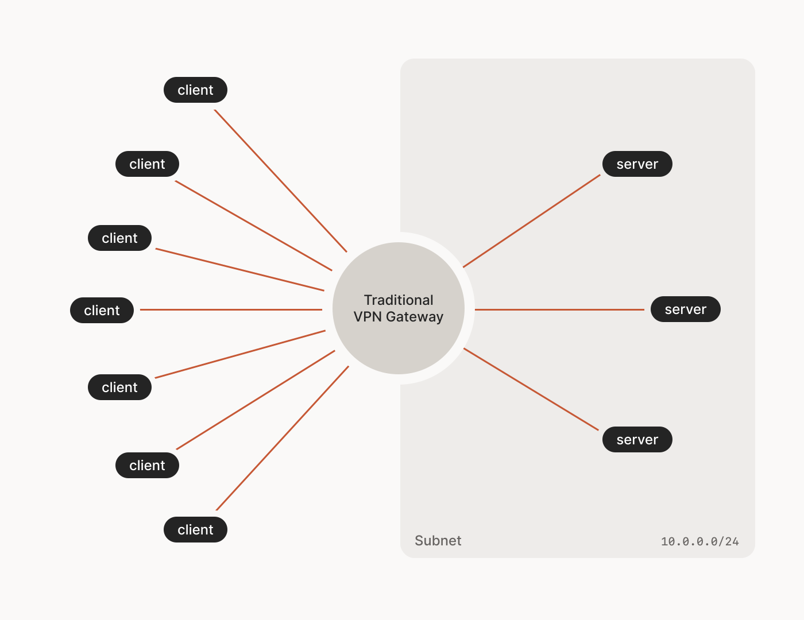
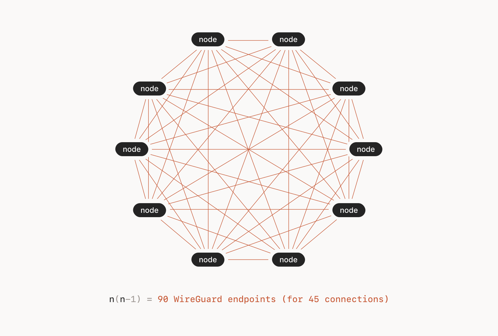

## What is a VPN?
A VPN or virtual private network is a network that you typically connect to via the Internet. It is used in situations where you may need to access information on a local network or a network not available to the public over an Internet connection.

It is usually done through a VPN service, although VPNs can be created and implemented using enterprise equipment and located on-premises at an organization. However, for this project, a VPN service will be used.

The VPN service works by hosting a VPN gateway which will control the network flow of all the connected devices. The VPN service will provide some basic software so that client devices such as laptops, computers, mobile devices, and servers can connect to the VPN gateway.

Once all these devices are connected, they are configured through the software to be on the same subnet and are able to talk to each other as if they were all next to each other.

One of the most important features of VPNs is *encryption*. Encryption is extremely important to prevent man-in-the-middle attacks and traffic sniffing. Encryption is what ultimately keeps the data-in-transit confidential.

There are many VPN service providers available, but most do charge fees to use their services. Another solution is to setup a virtual machine or Docker container that can run a local VPN service, such as OpenVPN. However, that is not entirely within the scope of the project.

*Tailscale* is a free (to a point) VPN service that will work perfectly for the project. The reason why it is mostly free is because of how TailScale operates.

## How does Tailscale work?
Before going on with this summary explanation, there is a lot of information about TailScale and the WireGuard protocol it uses. This is just a high level explanation of how TailScale works. For more information, visit https://tailscale.com/blog/how-tailscale-works/

Traditionally, VPNs are setup in a "hub and spoke" type design *(See Image 1 below for reference)*. This means that the "hub" is a VPN concentrator or gateway and the "spokes" are client devices connecting to the network such as desktops, laptops, servers, network devices, etc. All these devices can be referred to as "nodes".


*(Image 1: Hub and Spoke Architecture)*
"Hub and spoke" works great for smaller organizations with a small amount of connections or larger organizations who can afford efficient but expensive VPN gateway devices. This is because the VPN gateway tracks all the connections and manages all of the encrypted data flowing through the network. Therefore if it is left unmanaged, it can create a network bottleneck and lead to performance issues.

The other type of network design is a "mesh" network. This brings great performance but lacks the centralized control that a "hub and spoke" network has with its VPN gateway. *(See Image 2 below for reference)*.


*(Image 2: Mesh Architecture)*
What's interesting about TailScale is that it uses both a "mesh" style network and a "hub and spoke" style network. The way it does this is by splitting up the responsibilities of controlling connections (also called the control plane) and transferring data (also called the data plane).

In the data plane, peer-to-peer encrypted connections are made between nodes *directly*. This is done using the **WireGuard protocol** and it helps boost performance as the data does not have to travel through a VPN gateway first before reaching the other node. When all of the nodes are connected to one another, they appear as a mesh network. Some may be concerned with security when they hear peer-to-peer, but the security of the connection is managed by the control plane.

The control plane uses a hub and spoke design. The way it works is that TailScale hosts an instance in the cloud that acts as a "hub" and all of the connecting "nodes" are spokes. However, no data flows through the "hub". The "hub" in this case is what TailScale calls a "coordination server".

The coordination server is responsible for storing public keys of all of the nodes, and also other information such as where the node can be found, and ACLs (access control lists). The data flowing back and forth from the TailScale coordination server to the nodes is very minimal and thus can maintain high performance.

In short, to start a connection through TailScale, a device must authenticate first (more on that later), then it will talk with the TailScale coordination server to get connection information, public keys, and any ACLs in order to setup encrypted and secure tunnels to other devices.

The public keys are part of the private/public key pairs that are generated by each node when TailScale is installed. The private key always stays on the node and the public key is uploaded to the coordination server. Nodes that want to connect with other nodes won't be able to find where they are without some sort of routing knowledge. So, when a node uploads its public key, it also leaves some routing information that the coordination server will forward to any other node that wants to communicate.

As for security, the coordination server can be administrated through TailScale's website. The administrators can add ACLs for each node, or groups of nodes, and the ACLs will be distributed automatically when nodes request connections. This is similar to setting up firewall rules, but is much easier to manage. This will only allow certain nodes to talk to other nodes (also known as whitelisting).

In summary, what TailScale does is: 
- It takes the idea of having a performant but usually insecure mesh network and uses that for data transfer using the WireGuard protocol. 
- It manages all mesh connections and security with a centralized coordination server in the cloud using a "hub and spoke" style network. 
- Using private/public key pairs generated on nodes, it can ensure integrity and confidentiality of data. 
- With centralized ACLs at the coordination server, it can easily manage restrictions on connections. 
- It uses other trusted third-party identity providers to provide authentication for its service (i.e. Google, Microsoft, GitHub, Apple, etc.)

*NOTE: There are many topics that are important to TailScale's operation, such as NAT Traversal using advanced techniques based on the Internet STUN and ICE standards, encrypted TCP relays, audit logs, incremental deployment, etc. However, that is more than what's needed to know about the basic understanding and functioning of TailScale.*

### References
https://tailscale.com/blog/how-tailscale-works/
https://tailscale.com/blog/how-nat-traversal-works/

## Setting up Tailscale
1. Go to https://www.tailscale.com/
2. Create an account by using an existing trusted identity provider (i.e. GitHub, Microsoft, Google, etc.)
3. There are a few different options for downloading and installing Tailscale. Since this project uses a Linux server and a Windows laptop client, there will be two installation methods.

### Debian 12 VM Setup
1. Download and run the TailScale installation script:
	```bash
	sudo curl -fsSL https://tailscale.com/install.sh | sh
	```
2. Verify that the `tailscale0` network adapter has been added:
	```bash
	ip a
	```
3. On the TailScale website, go to "Settings".
4. On the left side, there will be a section called "Personal Settings". 
5. Under that, click on the button called "Keys".
	*NOTE: Here, an authorization key will be generated in order to authenticate with the TailScale service.*
5. Click on "Generate auth key..."
6. In the "Description" field, give the key a meaningful name like "capstone-server".
7. Leave everything else default, and click "Generate Key".
	*NOTE: The key will expire in 90 days. However, once it is used, it will be deleted.*
9. Copy the key to somewhere safe.
10. On the command line, enter the following command:
	```bash
	sudo tailscale up --authkey=<your_auth_key> --hostname="capstone-server"
	```
11. A "Success" message should appear. Also, TailScale will ask you to "Approve" the machine.
12. To approve the machine, go to the TailScale website and navigate to the "Machines" section at the top.
13. There should be a  "capstone-server" awaiting approval. Click "Approve".
14. Verify that the IPv4 address on the TailScale website matches the one on the Debian 12 VM for `tailscale0`:
	```bash
	ip a
	```

### Windows Client Setup
1. Download the TailScale Windows client software
2. Follow the installation process and run it.
3. Sign in with the same identity provider as used earlier.
4. Click "Connect".
5. Approve the new device in the "Machines" section on the TailScale website (similar to how the Debian 12 VM was approved).
6. Using PowerShell or cmd.exe, verify the IPv4 address matches the TailScale website:
	```
	ipconfig
	```

### Testing Connectivity
1. From the Debian 12 VM, ping the Windows client:
	```bash
	ping -I tailscale0 <ipv4_address_of_Windows_client>
	```
2. From the Windows client, ping the Debian 12 VM:
```bash
ping -S <ipv4_address_of_Windows_client> <ipv4_address_of_Debian_12_VM>
```
3. Both pings should be successful.

## Secure Connections with ACLs
*NOTE: TailScale by default will allow all connections between all TailScale clients. This is great for connectivity but terrible for security.*
There are two options to secure the TailScale network:
1. Create firewall rules on both the Windows client and Debian 12 VM separately.
2. Use TailScale's ACL feature which will push the ACL configuration automatically to all devices.

Option 2 will be used for this project.

### Creating Tags
*NOTE: In TailScale, devices that are connected to the network can be "tagged" and then associated with a specific group or user for role based access control (RBAC). Since this project is only using one user, assign both machines to the "owner" of the TailScale network.*
1. On the TailScale website, login and navigate to "Access Controls".
2. A JSON style file appears that can be edited within the browser.
3. Change the following section so it looks like the following code:
	```
		// Define the tags which can be applied to devices and by which users.
		"tagOwners": {
			//  	"tag:example": ["autogroup:admin"],
			"tag:laptop":          ["autogroup:owner"],
			"tag:capstone-server": ["autogroup:owner"],
		},
	```
	- In the above code, two tags are created for both the Windows client machine (laptop) and the Debian 12 VM (capstone-server).
	- Both are associated to the "owner" group.
5. Save the configuration at the bottom.
6. Navigate to the "Machines" tab at the top of the website.
7. For each machine, click the "..." button, and in the menu select "Edit ACL tags..."
8. Assign each machine the appropriate tag.

### Creating an ACL
*NOTE: The reason for creating the ACL is to only allow the laptop to connect to the capstone-server using HTTPS or port 443.*
1. On the TailScale website, navigate back to "Access Controls"
2. There is a section called `"acls"` where the code will be modified. Notice how there is already a rule there. This is the default rule to allow all traffic between nodes.
3. Comment that rule out and add the following code to allow only web traffic (HTTPS) from the laptop to the capstone-server:
```
	// Define access control lists for users, groups, autogroups, tags,
	// Tailscale IP addresses, and subnet ranges.
	"acls": [
		// Allow all connections.
		// Comment this section out if you want to define specific restrictions.
		//{"action": "accept", "src": ["*"], "dst": ["*:*"]},
		{
			"action": "accept",
			"src":    ["tag:laptop"],
			"proto":  "tcp",
			"dst":    ["tag:capstone-server:443"],
		},
	],
```
4. Save the configuration at the bottom.

## Connect to Kasm
*NOTE: Now that the Debian 12 VM and the Windows client can communicate through TailScale, the Windows client should be able to access the Kasm web GUI from any network with Internet access, as long as the Debian 12 VM is running.*
1. Verify that TailScale is running on both the Windows client and Debian 12 VM by logging into TailScale, navigating to the "Machines" section, and observing that both machines display "Connected".
2. TailScale uses MagicDNS to allow users to enter the hostname of the machine, rather than the IP address when browsing. So, on the Windows client machine, open up a web browser and go to the following address:
	```
	https://capstone-server
	```
	- The default port for HTTPS is 443, therefore no port number is appended.
3. A security warning will pop up because the certificate used by Kasm is "self-signed" and therefore not trusted. However, the connection is still encrypted with TLS 1.3. Click "Accept Risk and Continue".
4. Once the Kasm web GUI loads, log in with the Kasm user made in [[1.6 - Kasm Installation and Configuration#Add a new user]]
5. Once logged in, start up the "Brave" session and verify it works just as before.
6. Delete the "Brave" session.
7. Start up "psDooM" and have fun!