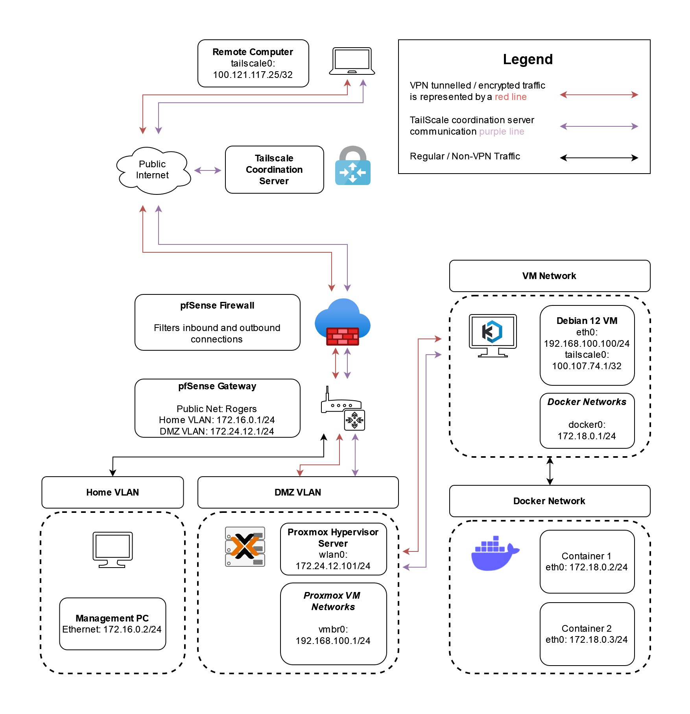

## Welcome to Coty's Capstone Project Documentation
This website is here to display all documentation in an easy to read format, with the ability to copy necessary code. Please use the menu on the left to navigate through the documentation.

## Capstone Project Summary
This projects demonstrates how to setup a secure network that can allow authorized individuals to access resources on an organization's local network from any remote location using a modern browser.

More specifically, the project will accomplish the following goals:
1. Configure a physical server with a Type 1 Hypervisor to host virtual machines.
2. Create a virtual machine that will run Docker and Kasm (a container streaming platform).
3. Create a custom container image that can be streamed using Kasm.
4. Set up a virtual private network using Tailscale.
5. Securing the network to only allow authorized access using multiple techniques (setting up a DMZ, creating firewall rules using UFW/iptables, creating ACLs, etc.)

## Network Diagram
